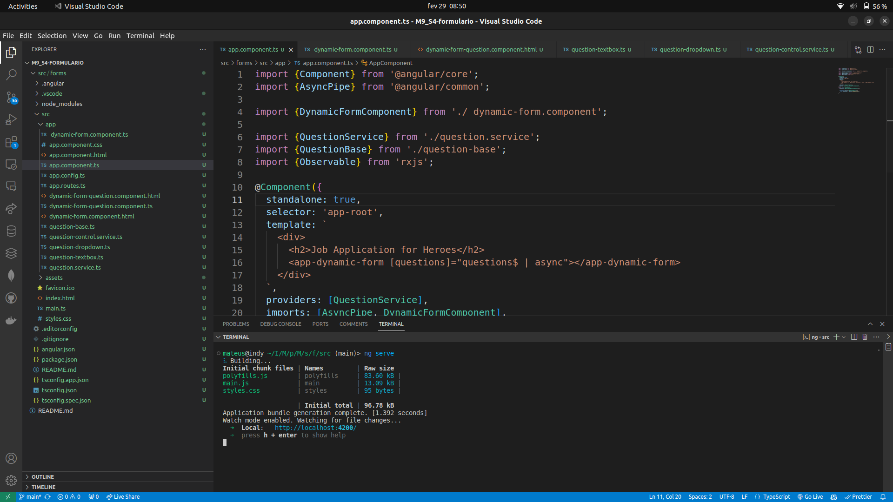

# M9_S4-formulario

Durante essa atividade foi desenvolvido um projeto em Angular com a implementação de um formulário dinâmico. A tecnologia utilizada para esse projeto foi o framework Angular que permite o desenvolvimento de páginas web utilizando o typescript e HTML. Com o Angular é possível desenvolver formulários dinâmicos que permitem uma rápida mudança nas perguntas realizadas, sem a necessidade de grandes alterações no código. O principal conceito aprendido durante a realização desse projeto foi o uso de componentes dinâmicos que podem ser dinamicamente adicionados ou removidos da aplicação. Com isso podemos que componentes dinâmicos são fortes ferramentas para aplicações web que permanecem com uma estrutura básica intacta e novas funcionalidades são facilmente adicionadas ou removidas, como no caso de um formulário que está em constante mudança. 

Código em execução:

formulário funcionando:

